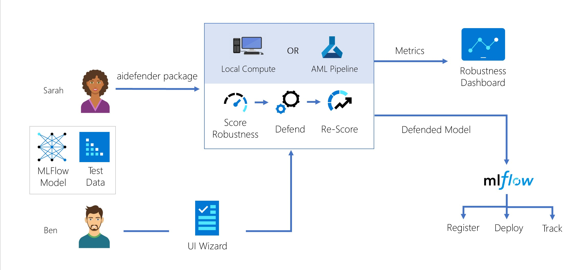

# Introduction 
Attacks against AI/ML models are becoming more prevalent with potentially devastating consequences. AI systems have become all pervasive in domains like automated cars, financial systems, health care systems, home security systems and other mission critical systems can be subjected to attacks violating confidentiality, integrity, availability, and privacy. 

Data scientists and ML professionals need an easy way to evaluate their models for robustness to these attacks before and after they deploy their models into these real-world scenarios. If their models are susceptible to these attacks, they also need a way to defend their models and increase their robustness to these attacks.

The AI Defender projects builds on [IBM's Adversarial Robustness Toolbox (ART)](https://github.com/Trusted-AI/adversarial-robustness-toolbox) in the following ways:
- This repo (aidefender) adds additional robustness metrics, attacks and defenses, using ART's base class structure. It provides a tighter integration with AzureML and MLFlow, with the ability to use MLFlow models with ART and easily generate AML pipelines for robust experimentation.
- The [responsible-ai-widgets](https://dev.azure.com/MAIDAP/AI%20Defender/_git/responsible-ai-widgets) repo provides a UI wizard that helps users pick robustness metrics and defenses to run on their models, and a UI dashboard that helps visualize and compare robustness and performance metrics across undefended and defended models.

# Getting Started
1.	Installation process
    - Make sure you have an anaconda-like package manager installed on your machine.
    - Open a terminal and create a new conda environment using `conda create --name aidefender python=3.7`
    - Activate your conda environment using `conda activate aidefender`
    - Install Azure Artifacts Keyring using `pip install keyring artifacts-keyring`
    - Install the aidefender package & dependencies using `pip install --extra-index-url https://pkgs.dev.azure.com/MAIDAP/82edae76-9731-47de-b36c-096ddaf57314/_packaging/AIDefenderPIP/pypi/simple/ aidefender`
    - You will now have the latest stable build of the aidefender package installed on your conda environment
    - To get started and try out some of the functionality of the package, try running some of our [notebooks](./notebooks/). We recommend getting started with [this notebook](./notebooks/demo_sarah_aidefender_from_local_notebook.ipynb), that show the flow for an ML scientist using the package. If you want to use AI Defender on your model and your data, follow [this notebook](./notebooks/demo_new_data_and_model.ipynb).
2.	Software dependencies
    - Conda environment with Python > 3.6
    - [requirements.txt](./requirements.txt) lists all the python dependencies of aidefender
3.	Latest releases of aidefender can be accessed through [this Azure Artifacts feed.](https://dev.azure.com/MAIDAP/AI%20Defender/_packaging?_a=feed&feed=AIDefenderPIP)
4.	Here is the [Technical Design Document](https://microsoft.sharepoint.com/:w:/t/NERDAIProgram2/EZifyjXVv6NAuS24aTGbDU4BmKBht3utpp2sRaEWvgs1CQ?e=28JVP9)

# Running the AzureML pipeline
To run the AML pipeline, follow the steps below:

 1. Create an AzureML workspace and place the corresponding `config.json` into the [aidefender/exp](./aidefender/exp/) dir. More information about setting up the AzureML workspace is provided in the official documentation: [Set up a Python development environment for Azure Machine Learning](https://docs.microsoft.com/en-us/azure/machine-learning/how-to-configure-environment#local)
 1. Register the dataset you want to use in AzureML using the official documentation: [Connect to data with the Azure Machine Learning studio](https://docs.microsoft.com/en-us/azure/machine-learning/how-to-connect-data-ui)
 1. Create the compute using the official documentation: [Create compute targets for model training and deployment in Azure Machine Learning studio](https://docs.microsoft.com/en-us/azure/machine-learning/how-to-create-attach-compute-studio)
 1. To run the pipeline locally given the data stored on a hard drive, run the [aidefender/exp/run_locally.sh](aidefender/exp/run_locally.sh) script. This script runs all steps of the pipeline. Edit the variables declared in the beginning of the script to customize path to the data and used models.
 1. To run the pipeline in AzureML, run the [aidefender/exp/run_pipeline.py](aidefender/exp/run_pipeline.py) script. Edit the variables in the beginning of the `main` function to specify the compute, dataset, and models to use in the pipeline. Run this script with the `--help` flag to see available options.

# North Star workflow Diagram
This is our north star workflow for the AI Defender project.

# Build and Test
The CI build pipelines are located [here.](https://dev.azure.com/MAIDAP/AI%20Defender/_build) There is a [CI pipeline](https://dev.azure.com/MAIDAP/AI%20Defender/_build?definitionId=31) that builds and tests the code on different environments and an [artifact pipeline](https://dev.azure.com/MAIDAP/AI%20Defender/_build?definitionId=35) that publishes the package to the artifact feed.

# Contribute
To contribute to the project, clone this repo on your dev machine to get started. Create a new conda environment and from the aidefender folder, run `pip install -e .` to install the package from the repo. You can test your changes and create feature branches on this repo to help tackle some items from our [feature backlog.](https://dev.azure.com/MAIDAP/AI%20Defender/_backlogs/backlog/AI%20Defender%20Team/Backlog%20items)